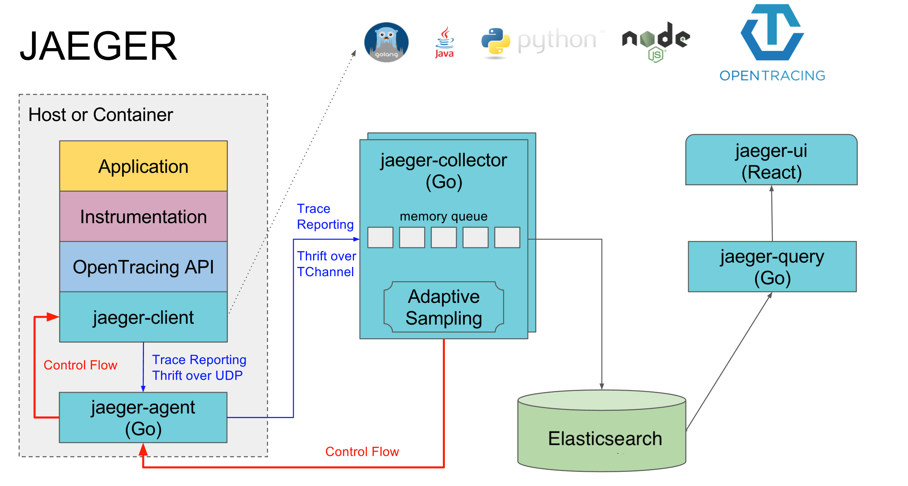

# jaeger-aws (distributed span tracing)

Opentracing is a tool that can help us to identify how data is passed through http calls
between and function calls within microservices.

This repo is an example terraform deployment to be used as a basis for your own deployments into an AWS ECS cluster.

The full jaeger documentation can be found here: https://www.jaegertracing.io/docs/1.8/



It consists of four main parts:

## jaeger-elasticsearch

This is a basic AWS hosted elasticsearch cluster to store spans in.

## jaeger-agent

This is an ECS daemon scheduled service -> ECS manages it so that it runs on every instance of the cluster. This is the first stage in collecting spans. Its main purpose is to sit close to the code and forward spans to the collector over some weird tchannel

## jaeger-collector

This collects and collates spans from all the jaeger agents and then writes data into an AWS hosted elasticsearch cluster.

## jaeger-query

This is the main interface we can use to query spans

# Running Locally

To run locally with as close as possible to production set up

```sh
docker-compose up
```

This will expose all the default jaeger ports as needed on localhost

* The jaeger-agent will be exposed at `localhost:6832`
* The UI on jaeger-query can be accessed at http://localhost:16686
